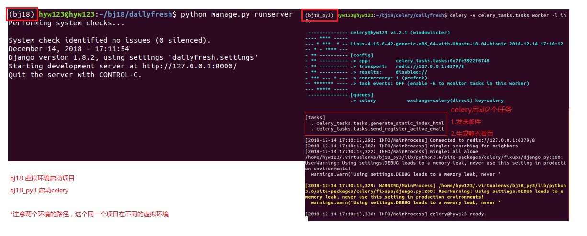
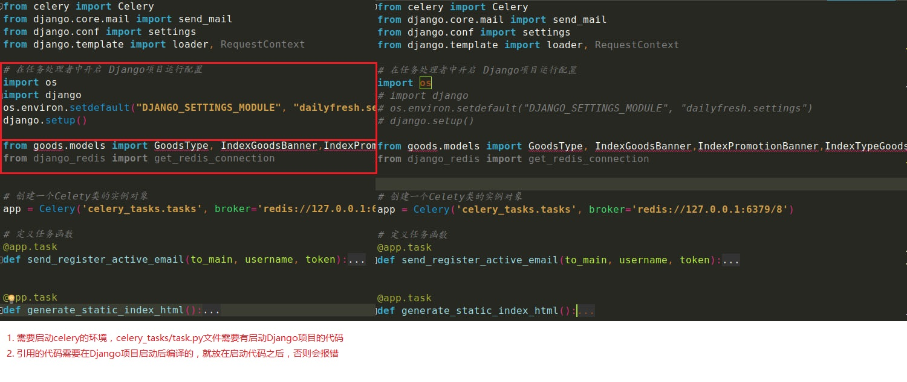

# celery
[celery官方文档](https://pypi.python.org/pypi/celery/)  

任务队列是一种跨线程、跨机器工作的一种机制.

任务队列中包含称作任务的工作单元。有专门的工作进程持续不断的监视任务队列，并从中获得新的任务并处理.

celery通过消息进行通信，通常使用一个叫Broker(中间人)来协client(任务的发出者)和worker(任务的处理者). clients发出消息到队列中，broker将队列中的信息派发给worker来处理。

一个celery系统可以包含很多的worker和broker，可增强横向扩展性和高可用性能。  
  

- ### celery
    - 安装：`pip install -U Celery`
    - 启动：`celery -A celery_tasks.tasks worker -l info`
- ### Broker
    > Celery需要一种解决消息的发送和接受的方式，我们把这种用来存储消息的的中间装置叫做message broker, 也可叫做消息中间人。 作为中间人，我们有几种方案可选择：
    
    1. #### RabbitMQ
        RabbitMQ是一个功能完备，稳定的并且易于安装的broker. 它是生产环境中最优的选择。使用RabbitMQ的细节参照以下链接： http://docs.celeryproject.org/en/latest/getting-started/brokers/rabbitmq.html#broker-rabbitmq

        如果我们使用的是Ubuntu或者Debian发行版的Linux，可以直接通过下面的命令安装RabbitMQ: `sudo apt-get install rabbitmq-server` 安装完毕之后，RabbitMQ-server服务器就已经在后台运行。如果您用的并不是Ubuntu或Debian, 可以在以下网址： http://www.rabbitmq.com/download.html 去查找自己所需要的版本软件。
    2. #### Redis
        Redis也是一款功能完备的broker可选项，但是其更可能因意外中断或者电源故障导致数据丢失的情况。 关于是有那个Redis作为Broker，可访下面网址： http://docs.celeryproject.org/en/latest/getting-started/brokers/redis.html#broker-redis
---
- ### 当前项目(天天生鲜)
    - [Celery代码](../celery_tasks/tasks.py)
    - 当前项目采用redis为Broker
    - 定义celery任务需要使用`@app.task`装饰器
    - 当前项目使用celery启动的任务为:
        - 发送邮件
        - 生成首页静态文件
    - celery可以分布式操作,放在别的电脑上启动,在当前项目中,我并没有使用另外的虚拟电脑(虚拟机),所以设置的redis地址为:`app = Celery('celery_tasks.tasks', broker='redis://127.0.0.1:6379/8')`为当前虚拟机的redis
    - 由于celery需要先开启中间人来操作任务,所以我将整个项目文件复制一份放到别外的虚拟环境中启动
        - 
    - 任务需要Django环境,所以需要启动Django环境
        - 
    
    
    
    
    
    
    
    
    
    
    
    
    
    
    
    
    
    
    
    
    
    
    
    
    
    
    
    
    